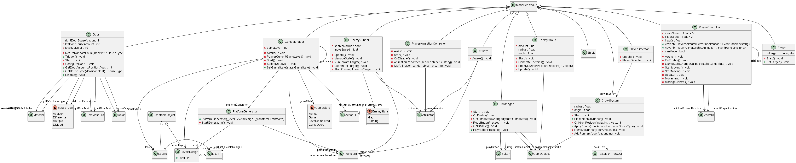

# Normal HyperCausal 
## Description

## Features

## Gameplay

## PlantUML Diagrams

### Class Diagram

## Screenshots

<!-- 

 -->
## Development

This game is developed using Unity3D game engine and programmed in C#. Contributions are welcome, whether it's bug fixes, feature enhancements, or optimizations.
## Credits

This game remake is created by Avinash Yadav.

## Feedback

If you have any feedback, suggestions, or bug reports, please open an issue on GitHub or contact us directly.

Prepare for liftoff and enjoy your journey to the International Space Station!